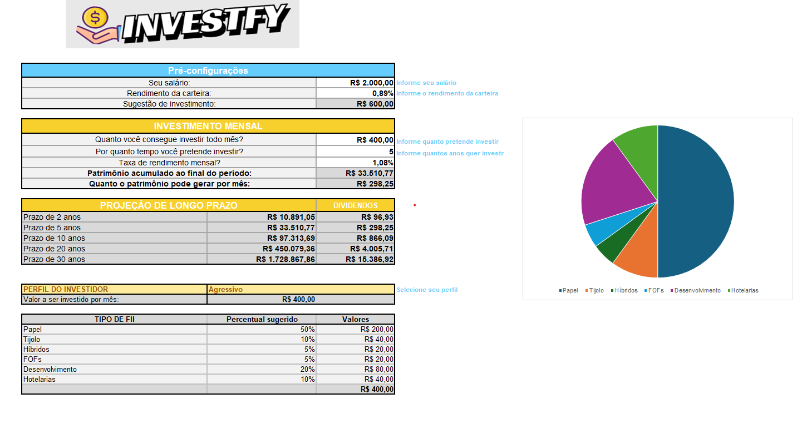

# Investfy 💰📊

Ferramenta de simulação e controle de investimentos em Fundos Imobiliários (FIIs),
desenvolvida em Excel, com foco na automatização de cálculos financeiros e na
visualização clara do potencial retorno dos investimentos.

---

## 🎯 Descrição do projeto

Este projeto consiste no desenvolvimento de uma planilha em Excel voltada à
simulação de investimentos em Fundos Imobiliários (FIIs), permitindo ao usuário
analisar cenários com base em variáveis como valor investido, tempo de aporte e
taxa de rendimento.

A ferramenta foi criada para auxiliar investidores a responder perguntas comuns
no processo de tomada de decisão, como:

- Quanto investir
- Por quanto tempo manter o investimento
- Qual o rendimento esperado
- Qual o patrimônio acumulado ao longo do tempo
- Qual o valor estimado de dividendos mensais

---

## 🧠 Objetivo da solução

Proporcionar uma visão clara e organizada do desempenho dos investimentos em FIIs,
automatizando cálculos financeiros e reduzindo a complexidade da análise manual.

A planilha foi estruturada para fins educacionais e de simulação, permitindo ao
usuário compreender melhor o funcionamento desse tipo de investimento.

---

## 📂 Estrutura da planilha

A ferramenta é composta por abas organizadas de forma lógica para facilitar o uso
e a leitura das informações, incluindo:

- Área de simulação de investimentos
- Controle dos valores aportados
- Visualização do patrimônio acumulado
- Cálculo estimado de dividendos mensais
- Organização dos dados do investidor

---

## 🛠️ Funcionalidades

- Simulação de investimentos em Fundos Imobiliários
- Cálculo automático do valor total investido
- Estimativa do patrimônio acumulado ao longo do tempo
- Cálculo de dividendos mensais
- Estrutura visual clara e de fácil interpretação
- Possibilidade de adaptação para diferentes cenários de investimento

---

## 🧮 Conceitos aplicados

- Cálculos financeiros em Excel
- Rendimento mensal
- Simulação de dividendos
- Organização e documentação de processos técnicos

---

## 🧰 Ferramentas utilizadas

- Excel Online
- Fórmulas financeiras e automações
- GitHub para versionamento e documentação técnica

---

## ▶️ Como utilizar

1. Faça o download do arquivo `Ferramenta de controle de investimentos.xlsx`
2. Abra o arquivo no Excel (Desktop ou Online)
3. Preencha os campos conforme os dados do investimento desejado
4. Analise os resultados gerados automaticamente pela planilha

---

## 📌 Contexto do projeto

Projeto desenvolvido como parte do **Bootcamp Excel com IA**, promovido pelo
**Santander em parceria com a DIO**, com o objetivo de aplicar conceitos de Excel
na construção de uma ferramenta prática de simulação de investimentos.

---

